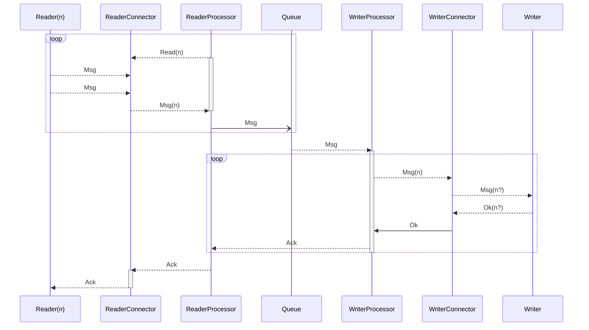

# BUGS

- flow order : start / server
- flow : processor : when to fail on startup : qlt-server-listen yes / qlt-client-startup no 

# TODO

- better logs
- light ui
- 

- error management:
  - writer connector lost and retry
    - possible duplication 
    - cleanup ack (ensure non ack duplication)
  - reader retry or early close : ack management
  - filter remove message : nil / or flag
  - windows management
  
- revisit yaml config file :
  - unsupported fields
  - support env variable subtitution
  - command line override
  - env override

- connector : simple-file (writer/reader) 
  - missing file position
- [x] connector : qlt-server-reader / qlt-server-writer
- connector : elasticsearch
- connector : lumberjack
- connector : mongodb
- connector : kafka
- connector : postgres
- connector : multi-file / filebuffer
- connector : (*)csv
- connector : (new) websocket
- connector : (new) qlt-client-pull/qlt-server-writer
- connector : (*) mem-writer / mem-reader / generator()
- connector : SQS
- connector : MQTT
- filter : xml-json
- filter : control (stuck/empty status)
- filter : parallel (ordered/any)
- chaos : ensure first disconnect/reconnect/Retry/delays/timeout/bad (data stream)
- tls : (everywhere)
- deduplication
- revisit log: (enable/disable)
- simple ui
- processor : initialization issue weirdness 

- Revisit Terminology : 
  - Consumer/Producer, Reader/Writer, Sender/Receiver, Pull/Push
  - Server/Client
  - Flow / Stream / Microflow / uflow
  - Processor : Runner / Filter / 

- Tests :
  - Network condition : timeout / break / slowdown / io error/close
  - [x] Verify all ack and content correspondence
  - ensure Dynamic Reader Memeory
  - Memory Leak / Fd fail
  - Go routine leaks :
    - Reader : 1 main (Read&Push), 1 ack(Write)
    - Writer : 1 main (pull&Write), 1 ack

- csv cyclelink
- ack (file offset + window) 
  - ensure producer proper restart 
    - from last committed state + duplicate flag
    - try to break : 
      - postgresDB connectivity
      - qlt server incoming connections (cleaned up),
      - file (no iisue)
      - kafka
      - mongo
  - ensure consumer proper retries
    - keep unacked in memory
    - try to break :
      - postgresDB
      - qlt client connection break/timeout
      - file (no issue?)
      - kafka
      - es
      - mongo
- verify ack robustess

