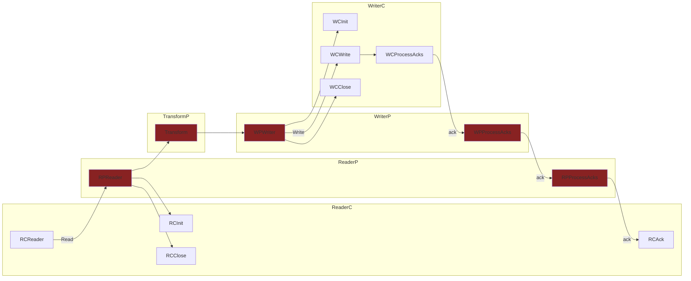

```mermaid
graph LR 
    %%subgraph R
        subgraph ReaderC
            RCInit
            RCReader
            RCAck
            RCClose
        end
        subgraph ReaderP
            RPReader
            RPProcessAcks
        end
    %%end
    subgraph TransformP
        Transform
    end
    %%subgraph W 
        subgraph WriterP
            WPWriter
            WPProcessAcks
        end
        subgraph WriterC
            WCInit
            WCWrite
            WCProcessAcks
            WCClose
        end
    %%end
    RCReader -- Read --> RPReader 
    RPReader --> Transform
    RPReader --> RCInit
    RPReader --> RCClose
    Transform ---> WPWriter
    WPWriter -- Write -->WCWrite
    WPWriter --> WCInit
    WPWriter --> WCClose
    WCProcessAcks -- ack --> WPProcessAcks
    WPProcessAcks -- ack --> RPProcessAcks
    RPProcessAcks -- ack --> RCAck
    WCWrite-->WCProcessAcks
    
    classDef goroutine fill:#822,stroke:#333 stroke-width:2px;
    class RPReader,Transform,WPWriter,WPProcessAcks,RPProcessAcks goroutine
```
